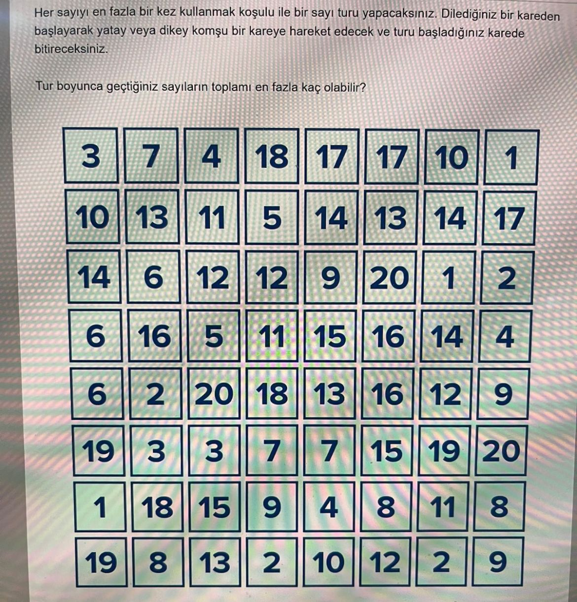

Her sayıyı en fazla bir kez kullanmak koşulu ile bir sayı turu yapacaksınız. 
Dilediğiniz bir kareden başlayarak yatay veya dikey komşu bir kareye hareket edecek ve turu başladığınız karede bitireceksiniz.
Tur boyunca geçtiğiniz sayıların toplamı en fazla kaç olabilir.

You will make a number round, using each number at most once. 
Starting from a square of your choice, you will move horizontally or vertically to a neighboring square and finish the round on the square you started on.
The sum of the numbers you pass during the round can be at most how many.

 